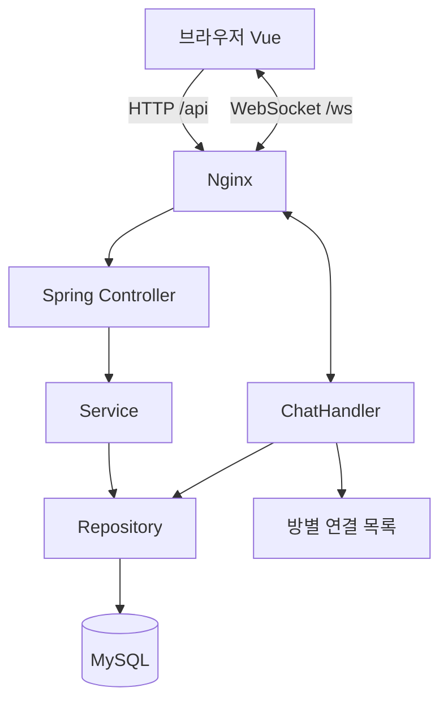
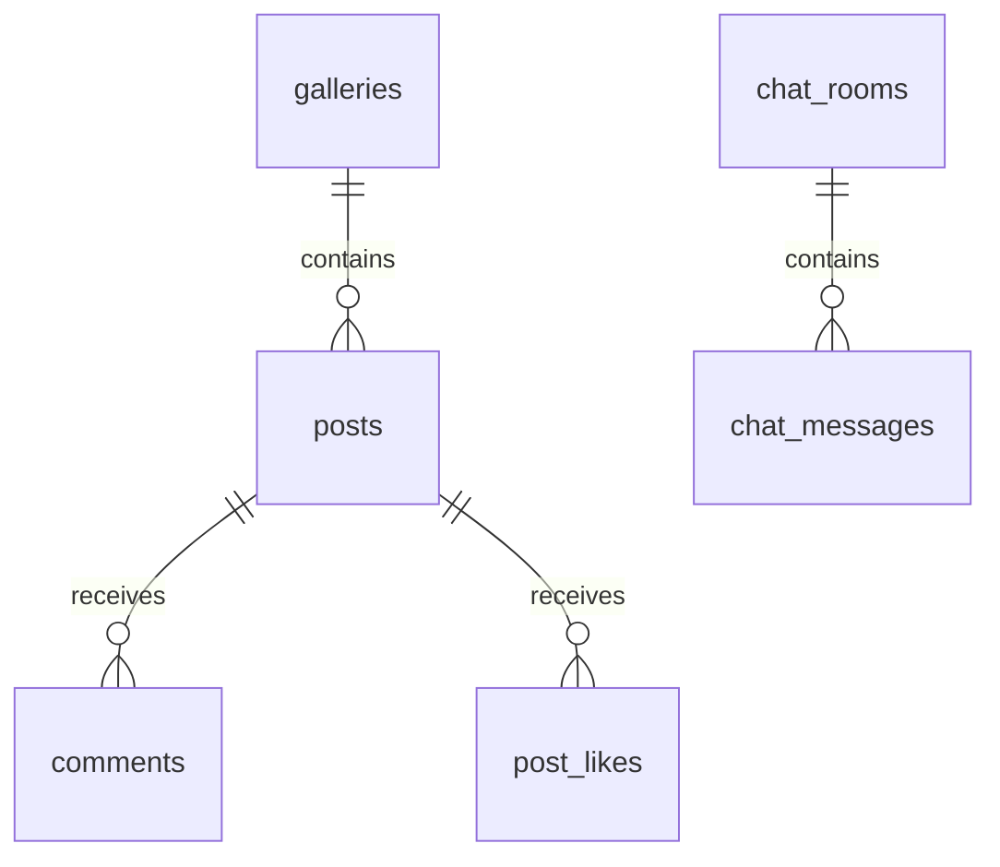
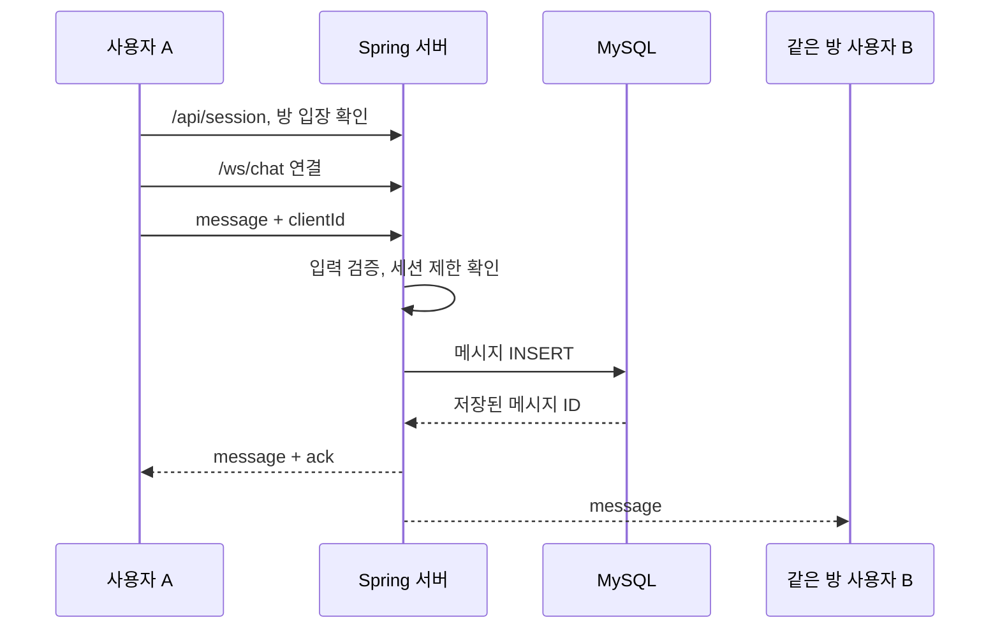

# 한글 학습 가이드

목표는 코드를 전부 외우는 것이 아니라, **화면에서 누른 버튼이 서버와 DB를 거쳐 다시 화면으로 돌아오는 길**을 이해하는 것입니다. SQL이 익숙하다면 `CommunityRepository`의 SQL부터 보고, 이를 호출하는 Service → Controller → Vue 순서로 거슬러 읽어도 좋습니다.

## 1단계. 전체 연결 구조



- **Vue:** 입력을 받고 서버 데이터를 보여 줍니다.
- **Controller:** HTTP URL을 Java 메서드에 연결하고 입력을 검증합니다.
- **Service:** 비밀번호 확인과 트랜잭션 등 업무 흐름을 다룹니다.
- **Repository:** SQL을 실행합니다. 이 프로젝트는 SQL 학습이 잘 보이도록 JPA 대신 Spring JDBC를 사용합니다.
- **MySQL:** 재시작 후에도 남아야 할 글·댓글·대화를 저장합니다.
- **Nginx:** 빌드된 Vue 파일을 제공하고 API와 WebSocket을 Spring Boot로 전달합니다.

## 2단계. Vue의 네 가지 문법부터 읽기

```vue
<script setup>
import { ref } from 'vue'
const title = ref('')
const save = () => console.log(title.value)
</script>

<template>
  <input v-model="title" />
  <p v-if="title">입력한 제목: {{ title }}</p>
  <button @click="save">저장</button>
</template>
```

- `ref`: 값이 바뀌면 화면도 갱신되는 상태입니다. JavaScript에서는 `.value`, 템플릿에서는 변수명으로 읽습니다.
- `v-model`: 입력칸과 변수를 양방향 연결합니다.
- `v-if`: 조건이 참일 때만 렌더링합니다.
- `@click`: 클릭 이벤트와 함수를 연결합니다.
- 실제 프로젝트의 `v-for`는 목록 반복, `computed`는 상태로부터 계산한 값, `watch`는 변화에 반응하는 동작입니다.

**실습:** `WriteView.vue`의 제목 입력칸 아래에 `{{ form.title.length }} / 150`을 표시해 보세요. 이 변경은 DB 구조를 바꿀 필요가 없습니다.

## 3단계. 글 등록을 끝까지 따라가기

1. `WriteView.vue`의 `form`에 `v-model`로 입력이 저장됩니다.
2. `<form @submit.prevent="submit">`가 기본 페이지 새로고침을 막고 `submit()`을 실행합니다.
3. `api('/posts', { method: 'POST', body: form })`이 `/api/posts`에 JSON을 보냅니다.
4. `CommunityController.create()`가 `PostInput`으로 JSON을 받습니다.
5. `@Valid`와 `@NotBlank`, `@Size`가 제목·내용·비밀번호 등의 길이를 검사합니다.
6. `CommunityService.create()`가 전송 간격과 비밀번호 해시를 처리합니다.
7. `CommunityRepository.createPost()`가 파라미터 바인딩으로 INSERT를 실행합니다.
8. DB에서 생성한 ID를 조회해 `Post` 응답으로 돌려줍니다.
9. Vue Router가 `/posts/{id}`로 이동합니다.

`fetch`는 Promise를 반환합니다. `await`는 응답이 도착할 때까지 **그 함수의 다음 줄**을 기다립니다. 브라우저 전체가 멈추는 것이 아닙니다. `try/catch/finally`는 성공·오류·버튼 대기 해제를 나누는 용도입니다.

**실습:** 브라우저 개발자 도구의 Network 탭에서 `/api/posts`의 Request Payload와 Response를 비교해 보세요. 비밀번호는 요청에는 있지만 응답에는 없어야 합니다.

## 4단계. SQL과 테이블 관계



`V1__schema.sql`을 보세요.

- `posts.gallery_id`: 글이 속한 갤러리를 가리키는 외래키입니다.
- `comments.post_id`: 댓글이 속한 글입니다. 글 삭제 시 `ON DELETE CASCADE`로 댓글도 지웁니다.
- `post_likes(post_id, actor_id)`: 두 컬럼을 합쳐 기본키로 사용해 같은 세션의 중복 추천을 막습니다.
- `(gallery_id, created_at, id)` / `(room_id, id)`: 갤러리·채팅방 기준 조회에 사용할 인덱스입니다.
- `app_settings`: 예시 데이터가 이미 삽입됐는지 기록합니다.

목록 쿼리에는 댓글 수와 추천 수를 가져오는 상관 서브쿼리가 있습니다. 데이터가 커지면 비용이 커질 수 있으므로 실제 MySQL의 `EXPLAIN ANALYZE`로 측정하고 집계 테이블·캐시·비정규화 여부를 결정합니다. 인덱스가 있다고 모든 필터·정렬이 자동 최적화되는 것은 아닙니다.

SQL의 `?`에는 `JdbcTemplate`이 값을 안전하게 바인딩합니다. 사용자 입력을 SQL 문자열에 그대로 연결하지 마세요. `sort`는 서버에서 허용한 값만 받고 고정된 `ORDER BY` 절을 선택합니다.

**실습:** 갤러리별 글 수를 직접 SQL로 조회한 뒤 `/api/galleries` 응답과 비교해 보세요.

```sql
SELECT g.name, COUNT(p.id) AS post_count
FROM galleries g
LEFT JOIN posts p ON p.gallery_id = g.id
GROUP BY g.id, g.name;
```

## 5단계. 수정 비밀번호를 왜 해싱할까?

`BCryptPasswordEncoder.encode()`는 원문 비밀번호를 복원하기 어려운 해시로 바꿉니다. 수정·삭제 시에는 저장된 해시와 `matches()`로 비교합니다. 같은 비밀번호도 솔트 때문에 매번 다른 해시가 나올 수 있습니다.

- 원문 비밀번호를 DB·로그·브라우저 저장소에 남기지 않습니다.
- DTO 응답에 `password_hash`를 포함하지 않습니다.
- 비밀번호가 맞아도 글의 작성자 식별코드를 입력으로 덮어쓸 수 없게 합니다.
- BCrypt는 UTF-8 기준 72바이트까지만 처리하므로 서버가 글자 수 제한 외에 바이트 길이도 확인합니다.

**실습:** 임시 글을 만들고 잘못된 비밀번호로 수정합니다. Network 탭에서 `403`과 JSON 오류를 확인하세요.

## 6단계. 일반 HTTP와 실시간 채팅

HTTP 글 조회는 요청할 때만 응답을 받습니다. 채팅은 연결을 유지하는 WebSocket을 사용하므로 다른 사람이 보낸 새 메시지를 서버가 즉시 보낼 수 있습니다.



읽는 순서는 `ChatPanel.vue` → `useChat.js` → `WebSocketConfig.java` → `ChatHandler.java` → `CommunityRepository.message()`입니다.

- 비밀번호방 입장은 HTTP 요청으로 확인합니다. URL에 비밀번호를 넣지 않습니다.
- WebSocket handshake도 비밀방 허가를 검사합니다. 화면에서만 잠그면 우회할 수 있습니다.
- 서버는 메시지의 임의 roomId를 신뢰하지 않고 **연결 시 확정한 방**에만 전송합니다.
- 전송 확인 `ack`는 보낸 소켓으로만 돌려줍니다. 같은 브라우저의 다른 탭 메시지와 구별합니다.
- 메시지 내용을 HTML로 삽입하지 않고 Vue의 `{{ }}`로 출력합니다.
- 최근 이력과 새 메시지가 겹칠 수 있어 서버 ID로 중복 제거 후 정렬합니다.
- 연결이 끊기면 최대 15초 간격까지 대기 시간을 늘리며 다시 연결합니다. 재연결 시 최근 100개부터 다시 표시합니다.

**실습:** 일반 창과 시크릿 창에서 같은 방에 접속해 서버를 재시작해 보세요. 상태가 바뀌고, 서버 복구 후 대화 기록을 다시 받는지 관찰합니다. 세션 초기화 때문에 익명 식별코드가 바뀌는 것도 확인하세요.

## 7단계. .env와 Docker의 역할

```text
.env → Compose 변수 치환 → backend 컨테이너 환경 변수 → application.yml → DB 연결
```

`.env`는 **서버 실행 설정**입니다. Vue에 `VITE_MYSQL_PASSWORD` 같은 변수를 만들면 번들에 포함되어 누구나 볼 수 있으므로 절대 넣지 않습니다.

Dockerfile의 `FROM ... AS build`는 빌드 단계입니다. Node/Maven으로 결과물을 만든 뒤 실제 실행 단계에는 Nginx 정적 파일 또는 JAR만 복사합니다.

Compose의 `depends_on`만으로 DB 준비 완료까지 기다리는 것은 아닙니다. 여기서는 `healthcheck`와 `condition: service_healthy`를 함께 사용합니다. `mysql-data`라는 named volume이 컨테이너가 없어져도 DB를 유지합니다.

**실습:** 색상 변수 `--navy`를 바꾸고 `docker compose up --build -d`로 다시 빌드합니다. 이 과정을 Vite 개발 서버의 즉시 반영과 비교해 보세요.

## 8단계. 다음 기능을 직접 추가한다면

현재 기능을 이해한 뒤 한 가지씩 확장하세요.

1. **대댓글:** `comments.parent_id` 추가 → API 입력·응답 변경 → 같은 게시글의 댓글인지 검증 → Vue 들여쓰기.
2. **이미지:** 파일 크기·확장자·실제 파일 유형 검증 → 파일 저장소 → URL 응답 → 본문 표시. DB에 큰 Base64 문자열부터 넣지 마세요.
3. **검색:** 실제 데이터의 실행 계획 확인 → MySQL FULLTEXT 실험 → 한국어 검색·운영 필요에 따라 Elasticsearch 검토.
4. **관리 기능:** 신고 테이블 → 관리자 인증·권한 → 글 숨김·채팅 제재 → 감사 기록.
5. **서버 확장:** 공유 세션과 메시지 브로커를 붙여 두 서버의 서로 다른 접속자끼리 대화하는지 검증.

변경이 테이블에 영향을 주면 기존 `V1`, `V2`를 수정하지 말고 `V3__...sql`을 만드세요. Flyway는 이미 실행한 파일의 체크섬을 확인합니다.
